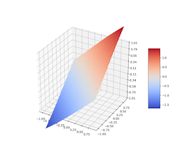

# Simple Normal Splines Examples

In this post we illustrate the normal spline interpolation method with a few simple examples.

Let's there is the following information of a smooth function ``\varphi (x,y), \, (x,y) \in R^2``:

```math
\begin{aligned}
\tag{1}
& \varphi (0, 0) = 0 \, ,
\\
&  \frac{ \partial{\varphi} }{ \partial{x} } (0, 0) =  1 \, ,
\\
& \frac{ \partial{\varphi} }{ \partial{y} } (0, 0) =  1 \, ,
\end{aligned}
```
and it is necessary to reconstruct ``\varphi`` using this data.

We assume this function is an element of the Bessel potential space ``H^{2.5}_\varepsilon (R^2)``, thereby it can be treated as a continuously differentiable function. We construct a normal spline ``\sigma_1^{(2.5)}`` approximating ``\varphi``:

```math
\begin{aligned}
\sigma_1^{(2.5)} = {\rm arg\,min}\{  \| \varphi \|^2_{H^{2.5}_\varepsilon} : (1), \   \forall \varphi \in {H^{2.5}_\varepsilon} (R^2) \} \, .
\end{aligned}
```
This spline can be presented as

```math
\sigma_1^{(2.5)} = \mu_1  h_1 +  \mu'_1  h'_1 +  \mu'_2  h'_2 \, ,
```

here
```math
\begin{aligned}
&  h_1 (\eta_1, \eta_2, \varepsilon) = \exp (-\varepsilon \sqrt{\eta_1^2 + \eta_2^2}) (1 + \varepsilon \sqrt{\eta_1^2 + \eta_2^2}) \, ,
\\
&  h'_1 (\eta_1, \eta_2, \varepsilon) = \varepsilon^2 \exp (-\varepsilon \sqrt{\eta_1^2 + \eta_2^2}) (\eta_1 + \eta_2) \, ,
\\
&  h'_2 (\eta_1, \eta_2, \varepsilon)  =   h'_1 (\eta_1, \eta_2, \varepsilon) \,  , \  (\eta_1, \eta_2) \in R^2 \, ,
\end{aligned}
```
and coefficients ``(\mu_1, \mu'_1, \mu'_2)`` are defined from the system:

```math
\begin{bmatrix}
   1 & 0 & 0  \\
   0 & 2\varepsilon^2 & 0  \\
   0 & 0 & 2\varepsilon^2  \\
   \end{bmatrix} \left[ \begin{array}{c} \mu_1 \\ \mu'_1 \\ \mu'_2 \end{array} \right] =
\left[ \begin{array}{c} 0 \\ 1 \\ 1 \end{array} \right] \, .
```

Eventually
```math
\sigma_1^{(2.5)} (x, y, \varepsilon) = \exp (-\varepsilon \sqrt{x^2 + y^2}) (x + y) \, , \quad (x,y) \in R^2.
```


Fig.1 Spline ``\sigma_1^{(2.5)}, \, \varepsilon = 1``




Fig.2 Spline ``\sigma_1^{(2.5)}, \, \varepsilon = 0.1``

Now let function ``\varphi (x,y), \ (x,y) \in R^2`` is a twice continuously differentiable function which satisfies constraints:

```math
\begin{aligned}
\tag{2}
 & \varphi (0, 0) = 0 \, ,
\\
 &  \frac{ \partial{\varphi} }{ \partial{x} } (0, 0) + \frac{ \partial{\varphi} }{ \partial{y} } (0, 0)  =  2 \, .
\end{aligned}
```
We approximate it by constructing a normal spline ``\sigma_1^{(3.5)}`` in ``H^{3.5}_\varepsilon (R^2)``: 

```math
\begin{aligned}
& \sigma_1^{(3.5)} = {\rm arg\,min}\{  \| \varphi \|^2_{H^{3.5}_\varepsilon} : (2), \  \forall \varphi \in {H^{3.5}_\varepsilon} (R^2) \} \, , \\
& \sigma_1^{(3.5)} = \mu_1  h_1 +  \mu'_1  h'_1 \, ,
\end{aligned} 
```
where

```math
\begin{aligned}
&  h_1 (\eta_1, \eta_2, \varepsilon) = \exp (-\varepsilon \sqrt{\eta_1^2 + \eta_2^2}) (3 + 3\varepsilon \sqrt{\eta_1^2 + \eta_2^2} + \varepsilon^2 (\eta_1^2 + \eta_2^2)) \, ,
\\
&  h'_1 (\eta_1, \eta_2, \varepsilon) = \varepsilon^2 \exp (-\varepsilon \sqrt{\eta_1^2 + \eta_2^2}) (1 +\varepsilon \sqrt{\eta_1^2 + \eta_2^2}) (\eta_1 + \eta_2) \, ,
\end{aligned} 
```
and coefficients ``(\mu_1, \mu'_1)`` are defined from the system:

```math
\begin{bmatrix}
   3 &  0  \\
   0 & 2\varepsilon^2 \\
   \end{bmatrix} \left[ \begin{array}{c} \mu_1 \\ \mu'_1 \end{array} \right] =
\left[ \begin{array}{c} 0 \\ 2 \end{array} \right] \, .
```
Therefore

```math
\begin{aligned}
& \sigma_1^{(3.5)} (x, y, \varepsilon) = \exp (-\varepsilon \sqrt{x^2 + y^2}) (1 + \varepsilon \sqrt{x^2 + y^2}) (x + y) \, , 
\\ 
& (x,y) \in R^2.
\end{aligned}
```

As the last example consider a problem of reconstructing a continuously differentiable function ``\varphi (x), \  x \in R``, which satisfies constraint

```math
\tag{3}
\frac {d\varphi} {dx} (0) = 1 \, ,
```
and it is closest to function ``z(x) = 2 x, \, x \in R``. We approximate it by constructing a normal spline ``\sigma_1^{(2)}`` in ``H^{2}_\varepsilon (R)``:

```math
\begin{aligned}
& \sigma_1^{(2)} = {\rm arg\,min}\{  \| \varphi  - z \|^2_{H^{2}_\varepsilon} : (3), \   \forall \varphi \in {H^{2}_\varepsilon} (R) \} \, , 
\\
& \sigma_1^{(2)} = z + \mu'_1  h'_1 = 2x + \mu'_1  h'_1  \, ,
\end{aligned}
```
Performing calculations analogous to previous ones, we'll receive:
```math
\sigma_1^{(2)} (x, \varepsilon) = 2 x - x \exp (-\varepsilon |x|) \, , \quad x \in R.
```

