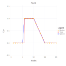

# Example Usage

## 1D interpolation case

Let's interpolate function ``f(x)``

```math
f(x) =
    \begin{cases}
       0 \, , &  1 \le x \lt 6 \\
       1 \, , &  6 \le x \le 10 \\
       -x/5 + 3 \, , &  6 \le x \le 15 \\
       0 \, , &  15 \le x \le 20 
    \end{cases}
```
by values of the function in nodes ``\{1, 2, 3, ..., 20\}`` (case A) and by values of the function and values of its first derivatives in the same nodes (case B).

```@meta
DocTestSetup = quote
    using NormalHermiteSplines
end
```

A)

```@example A
    using NormalHermiteSplines

    x = collect(1.0:1.0:20)       # function nodes
    u = x.*0.0                    # function values in nodes
    for i in 6:10
        u[i] = 1.0
    end
    for i in 11:14
        u[i] = -0.2 * i + 3.0
    end

    # Build a differentiable spline by values of function in nodes
    # (a spline built with RK_H0 kernel is a continuous function,
    #  a spline built with RK_H1 kernel is a continuously differentiable function,
    #  a spline built with RK_H2 kernel is a twice continuously differentiable function).
    # Here value of the 'scaling parameter' ε is estimated in the interpolate procedure.
    spline = prepare(x, RK_H1())
    
    # An estimation of the Gram matrix condition number
    cond = get_cond(spline)
```

```@example A
    # A value of the 'scaling parameter' of Bessel Potential space
    # the normal spline was built in.
    ε = get_epsilon(spline)
```

```@example A
    spline = construct(spline, u)

    p = collect(1.0:0.2:20)        # evaluation points
    σ = evaluate(spline, p)
    σ = nothing                    # hide
```


```@example A
    dσ = similar(p)
    for i=1:length(p)
        dσ[i] = evaluate_derivative(spline, p[i])
    end
```


Evaluate the spline at some points:

```@example A
    p = [3.1, 8.1, 12.1, 18.1]
    σ = evaluate(spline, p)
```

Evaluate the spline derivatives at the same points:

```@example A
    dσ = similar(p)
    for i=1:length(p)
        dσ[i] = evaluate_derivative(spline, p[i])
    end
    dσ
```

Construct spline by different function values in nodes and evaluate new spline at the same evaluation points:

```@example A
    u2 = 2.0 .* u
    spline = construct(spline, u2)
    σ = evaluate(spline, p)
```

B)

```@example B
    using NormalHermiteSplines

    x = collect(1.0:1.0:20)       # function nodes
    u = x.*0.0                    # function values in nodes
    for i in 6:10
        u[i] = 1.0
    end
    for i in 11:14
        u[i] = -0.2 * i + 3.0
    end

    s = x                         # function first derivative nodes
    v = x.*0.0                    # function first derivative values
    for i in 11:14
        v[i] = -0.2
    end

    # Build a differentiable spline by values of function,
    # and values of its first derivatives in nodes
    # (a spline built with RK_H0 kernel is a continuous function,
    #  a spline built with RK_H1 kernel is a continuously differentiable function,
    #  a spline built with RK_H2 kernel is a twice continuously differentiable function).
    # Here value of the 'scaling parameter' ε is estimated in the interpolate procedure.
    spline = interpolate(x, u, s, v, RK_H1())

    p = collect(1.0:0.2:20)      # evaluation points
    σ = evaluate(spline, p)
    σ = nothing                    # hide
```



```@example B
    dσ = similar(p)
    for i=1:length(p)
        dσ[i] = evaluate_derivative(spline, p[i])
    end
```


Evaluate the spline at some points:

```@example B
    p = [3.1, 8.1, 12.1, 18.1]
    σ = evaluate(spline, p)
```

Evaluate the spline derivatives at the same points:

```@example B
    dσ = similar(p)
    for i=1:length(p)
        dσ[i] = evaluate_derivative(spline, p[i])
    end
    dσ
```

## 2D interpolation case

....
....

## 3D interpolation case


## Choice of the scaling parameter
aa

## Q & A
ss
