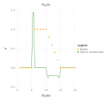

# Example Usage

## 1D interpolation case

Let's interpolate function ``f(x)``

```math
f(x) =
    \begin{cases}
       0 \, , &  1 \le x \lt 6 \\
       1 \, , &  6 \le x \le 10 \\
       -x/5 + 3 \, , &  6 \le x \le 15 \\
       0 \, , &  15 \le x \le 20 
    \end{cases}
```
by values of the function in nodes ``\{1, 2, 3, ..., 20\}`` (case A) and by values of the function and values of its first derivatives in the same nodes (case B).

```@meta
DocTestSetup = quote
    using Random
    using NormalHermiteSplines
end
```

A)

```@example A
    using NormalHermiteSplines

    x = collect(1.0:1.0:20)       # function nodes
    u = x.*0.0                    # function values in nodes
    for i in 6:10
        u[i] = 1.0
    end
    for i in 11:14
        u[i] = -0.2 * i + 3.0
    end

    # Build a differentiable spline by values of function in nodes
    # (a spline built with RK_H0 kernel is a continuous function,
    #  a spline built with RK_H1 kernel is a continuously differentiable function,
    #  a spline built with RK_H2 kernel is a twice continuously differentiable function).
    # Here value of the 'scaling parameter' ε is estimated in the interpolate procedure.
    spline = prepare(x, RK_H1())
    
    # An estimation of the Gram matrix condition number
    cond = get_cond(spline)
```

```@example A
    # A value of the 'scaling parameter' of Bessel Potential space
    # the normal spline was built in.
    ε = get_epsilon(spline)
```

```@example A
    spline = construct(spline, u)

    p = collect(1.0:0.2:20)        # evaluation points
    σ = evaluate(spline, p)
    σ = nothing                    # hide
```


```@example A
    dσ = similar(p)
    for i=1:length(p)
        dσ[i] = evaluate_derivative(spline, p[i])
    end
```


Evaluate the spline at some points:

```@example A
    p = [3.1, 8.1, 12.1, 18.1]
    σ = evaluate(spline, p)
```

Evaluate the spline derivatives at the same points:

```@example A
    dσ = similar(p)
    for i=1:length(p)
        dσ[i] = evaluate_derivative(spline, p[i])
    end
    dσ
```

Construct spline by different function values in nodes and evaluate new spline at the same evaluation points:

```@example A
    u2 = 2.0 .* u
    spline = construct(spline, u2)
    σ = evaluate(spline, p)
```

B)

```@example B
    using NormalHermiteSplines

    x = collect(1.0:1.0:20)       # function nodes
    u = x.*0.0                    # function values in nodes
    for i in 6:10
        u[i] = 1.0
    end
    for i in 11:14
        u[i] = -0.2 * i + 3.0
    end

    s = x                         # function first derivative nodes
    v = x.*0.0                    # function first derivative values
    for i in 11:14
        v[i] = -0.2
    end

    # Build a differentiable spline by values of function,
    # and values of its first derivatives in nodes
    # (a spline built with RK_H0 kernel is a continuous function,
    #  a spline built with RK_H1 kernel is a continuously differentiable function,
    #  a spline built with RK_H2 kernel is a twice continuously differentiable function).
    # Here value of the 'scaling parameter' ε is estimated in the interpolate procedure.
    spline = interpolate(x, u, s, v, RK_H1())

    p = collect(1.0:0.2:20)      # evaluation points
    σ = evaluate(spline, p)
    σ = nothing                    # hide
```


```@example B
    dσ = similar(p)
    for i=1:length(p)
        dσ[i] = evaluate_derivative(spline, p[i])
    end
```


Evaluate the spline at some points:

```@example B
    p = [3.1, 8.1, 12.1, 18.1]
    σ = evaluate(spline, p)
```

Evaluate the spline derivatives at the same points:

```@example B
    dσ = similar(p)
    for i=1:length(p)
        dσ[i] = evaluate_derivative(spline, p[i])
    end
    dσ
```

## 2D interpolation case

Let's interpolate function ``\phi (x,y)  = \frac{2}{3}cos(10x)sin(10y) + \frac{1}{3}sin(10xy)`` defined on unit square ``\Omega = [0,1]^2``.

```@raw html

``` ```@raw html

```  ```@raw html

```
We built a spline using function ``\phi`` values sampled on set of 200 pseudo-random nodes uniformly distributed on ``\Omega`` (case A).

Spline plot                                                                        Approximation error plots

```@raw html

``` ```@raw html

```  ```@raw html

```
and 

using function ``\phi`` values sampled on set of 200 pseudo-random nodes uniformly distributed on ``\Omega`` and 80 function ``\phi`` gradient values defined at nodes located on the border of domain ``\Omega`` (case B):

```@raw html
 
```
here red dots represent the function ``\phi`` gradient value nodes. 

Spline plot                                                                         Approximation error plots

```@raw html

``` ```@raw html

```  ```@raw html

```
Following is the code example for case A:

```@example 2A
    using Random
    using NormalHermiteSplines

    # generating 200 uniform random nodes
    m = 200
    nodes = Matrix{Float64}(undef, 2, m)
    rng = MersenneTwister(0);
    rnd = rand(rng, Float64, (2, m))
    for i = 1:m
        nodes[1, i] = rnd[1, i]
        nodes[2, i] = rnd[2, i]
    end

    # creating the uniform Cartesian grid of size 51x51 on [0, 1]x[0, 1]
    t = 50
    x = collect(range(0.0, 1.0; step = 1.0/t))
    y = collect(range(0.0, 1.0; step = 1.0/t))
    t1 = t + 1

    grid = Matrix{Float64}(undef, 2, t1^2)
    for i = 1:t1
        for j = 1:t1
            r = (i - 1) * t1 + j
            grid[1, r] = x[i]
            grid[2, r] = y[j]
        end
    end

    n_1 = size(nodes, 2)
    u = Vector{Float64}(undef, n_1)     # function values
    for i = 1:n_1
        x = nodes[1,i]
        y = nodes[2,i]
        u[i] = (2.0*cos(10.0*x)*sin(10.0*y) + sin(10.0*x*y))/3.0
    end

    # Here spline is being constructed with RK_H1 kernel,
    # the 'scaling parameter' ε is defined explicitly.
    rk = RK_H1()
    #
    spline = interpolate(nodes, u, rk)
    cond = get_cond(spline)
```

```@example 2A
    # A value of the 'scaling parameter' of Bessel Potential space
    # the normal spline was built in.
    ε = get_epsilon(spline)
```

```@example 2A

    σ = evaluate(spline, grid)
    σ = nothing
```

Value of function ``\phi`` at evaluation point ``p = [0.5; 0.5]``
```@example 2A
    p = [0.5; 0.5]
    x = p[1]
    y = p[2]
    f = (2.0*cos(10.0*x)*sin(10.0*y) + sin(10.0*x*y))/3.0
```

Value of spline at the evaluation point:
```@example 2A
    σ = evaluate_one(spline, p)
```

Difference of function ``\phi`` and spline values at the evaluation point:
```@example 2A
    diff = f - σ
```

Gradient of function ``\phi`` at the evaluation point
```@example 2A
    g1 = (10.0*y*cos(10.0*x*y) - 20.0*sin(10.0*x)*sin(10.0*y))/3.0
    g2 = (20.0*cos(10.0*x)*cos(10.0*y) + 10.0*x*cos(10.0*x*y))/3.0 
    f_grad = [g1; g2]
```

Gradient of spline at the evaluation point
```@example 2A
    σ_grad = evaluate_gradient(spline, p)
```

Norm of difference of function ``\phi`` and spline gradient values at the evaluation point:
```@example 2A
    diff_grad = sqrt(sum((f_grad .- σ_grad).^2))
```

Corresponding code example for case B:

```@example 2B
    using Random
    using NormalHermiteSplines

    # generating 200 uniform random nodes
    m = 200
    nodes = Matrix{Float64}(undef, 2, m)
    rng = MersenneTwister(0);
    rnd = rand(rng, Float64, (2, m))
    for i = 1:m
        nodes[1, i] = rnd[1, i]
        nodes[2, i] = rnd[2, i]
    end

    # creating the uniform Cartesian grid of size 51x51 on [0, 1]x[0, 1]
    t = 50
    x = collect(range(0.0, 1.0; step = 1.0/t))
    y = collect(range(0.0, 1.0; step = 1.0/t))
    t1 = t + 1

    grid = Matrix{Float64}(undef, 2, t1^2)
    for i = 1:t1
        for j = 1:t1
            r = (i - 1) * t1 + j
            grid[1, r] = x[i]
            grid[2, r] = y[j]
        end
    end

    n_1 = size(nodes, 2)
    u = Vector{Float64}(undef, n_1)     # function values
    for i = 1:n_1
        x = nodes[1,i]
        y = nodes[2,i]
        u[i] = (2.0*cos(10.0*x)*sin(10.0*y) + sin(10.0*x*y))/3.0
    end

    # Here spline is being constructed with RK_H1 kernel,
    # the 'scaling parameter' ε is defined explicitly.
    rk = RK_H1()
    #
    spline = interpolate(nodes, u, rk)
    cond = get_cond(spline)
```

```@example 2B
    # A value of the 'scaling parameter' of Bessel Potential space
    # the normal spline was built in.
    ε = get_epsilon(spline)
```

```@example 2B

    σ = evaluate(spline, grid)
    σ = nothing
```

Value of function ``\phi`` at evaluation point ``p = [0.5; 0.5]``
```@example 2B
    p = [0.5; 0.5]
    x = p[1]
    y = p[2]
    f = (2.0*cos(10.0*x)*sin(10.0*y) + sin(10.0*x*y))/3.0
```

Value of spline at the evaluation point:
```@example 2B
    σ = evaluate_one(spline, p)
```

Difference of function ``\phi`` and spline values at the evaluation point:
```@example 2B
    diff = f - σ
```

Gradient of function ``\phi`` at the evaluation point
```@example 2B
    g1 = (10.0*y*cos(10.0*x*y) - 20.0*sin(10.0*x)*sin(10.0*y))/3.0
    g2 = (20.0*cos(10.0*x)*cos(10.0*y) + 10.0*x*cos(10.0*x*y))/3.0 
    f_grad = [g1; g2]
```

Gradient of spline at the evaluation point
```@example 2B
    σ_grad = evaluate_gradient(spline, p)
```

Norm of difference of function ``\phi`` and spline gradient values at the evaluation point:
```@example 2B
    diff_grad = sqrt(sum((f_grad .- σ_grad).^2))
```


## Q & A

Q1. *Question*: The call

```julia
interpolate(x, u, RK_H3())
```

cause the following error: `PosDefException: matrix is not positive definite; Cholesky factorization failed.` What is a reason of the error and how to resolve it?

A1. *Answer*: Creating a Bessel Potential kernel object with omitted parameter `ε` means that this paramter will be estimated during interpolating procedure execution. It might happen that estimated value of the `ε` is too small and corresponding  Gram matrix of linear system of equations which defines the normal spline coefficients is very ill-conditioned and it lost its positive definiteness because of floating-point rounding errors.  

There are two ways to fix it.

- We can get the estimated value of `ε` by calling function `get_epsilon()`:

```julia
ε = get_epsilon()
```

then we could try to call the `interpolate` function with greater `ε` value of the reproducing kernel parameter:

```julia
interpolate(x, u, RK_H3(10.0*ε))
```

- We may change the precision of floating point calculations. Namely it is possible to use Julia standard BigFloat numbers or Double64 - extended precision float type from the package [DoubleFloats](https://github.com/JuliaMath/DoubleFloats.jl):

```julia
using DoubleFloats

x = Double64.(x)
u = Double64.(u)
interpolate(x, u, RK_H3())
```

This answer also applies to types `RK_H1()` and `RK_H2()`.

Q2. *Question*: The call

```julia
interpolate(x, u, RK_W3())
```

cause the following error: `PosDefException: matrix is not positive definite; Cholesky factorization failed.` How to resolve it?

A2. *Answer*: The reason of that exception is the Gram matrix of linear system of equations which defines the normal spline coefficients is very ill-conditioned and it lost its positive definiteness because of floating-point rounding errors.  

The only way to fix it - is using floating-point arithmetic with extended precision. It can be provided by Julia standard BigFloat type or Double64 type from the package
[DoubleFloats](https://github.com/JuliaMath/DoubleFloats.jl):

```julia
using DoubleFloats

x = Double64.(x)
u = Double64.(u)
interpolate(x, u, RK_W3())
```

This answer also applies to types `RK_W1()` and `RK_W2()`.

Q3. *Question*: The following calls

```julia
interpolate(x, u, RK_H3())
σ = evaluate(p)
```

produce the output which is not quite satisfactoty.
Is it possible to improve the quality of interpolation?

A3. *Answer*: Creating a Bessel Potential kernel object with omitted parameter `ε` means that this paramter will be estimated during interpolating procedure execution. It might happen that estimated value of the `ε` is too large and it is possible to use a smaller `ε` value which would result in better quality of interpolation. We can get the estimated value of `ε` by calling function `get_epsilon()`:

```julia
ε = get_epsilon()
```

and get an estimation of the problem's Gram matrix condition number by calling `get_cond()` function:

```julia
cond = get_cond()
```

In a case when estimated condition number is not very large, i.e. less than ``10^{12}`` using standard `Float64` floating-point arithmetic, we may attempt to build a better interpolation spline by calls:

```julia
interpolate(x, u, RK_H3(ε/5))
σ = evaluate(p)
```

Another option is using a smaller value of the `ε` and perform calculations using extended precision floating-point arithmetic.
